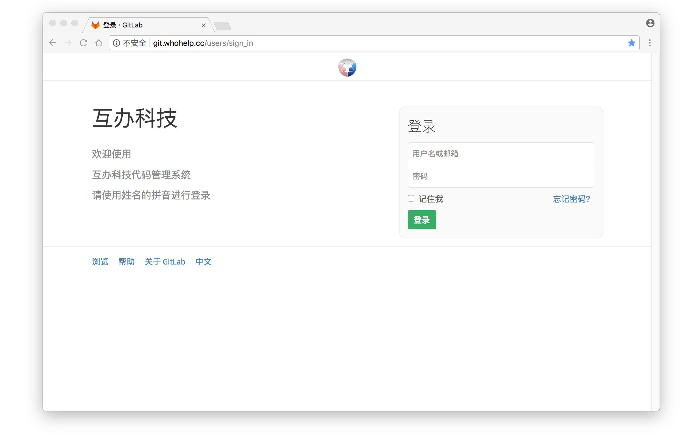
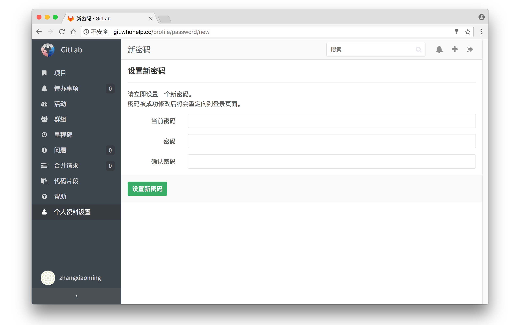
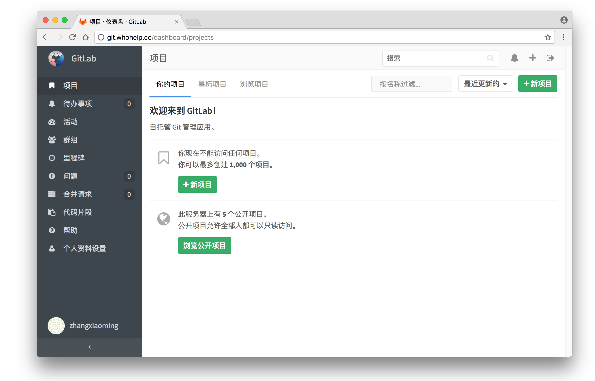
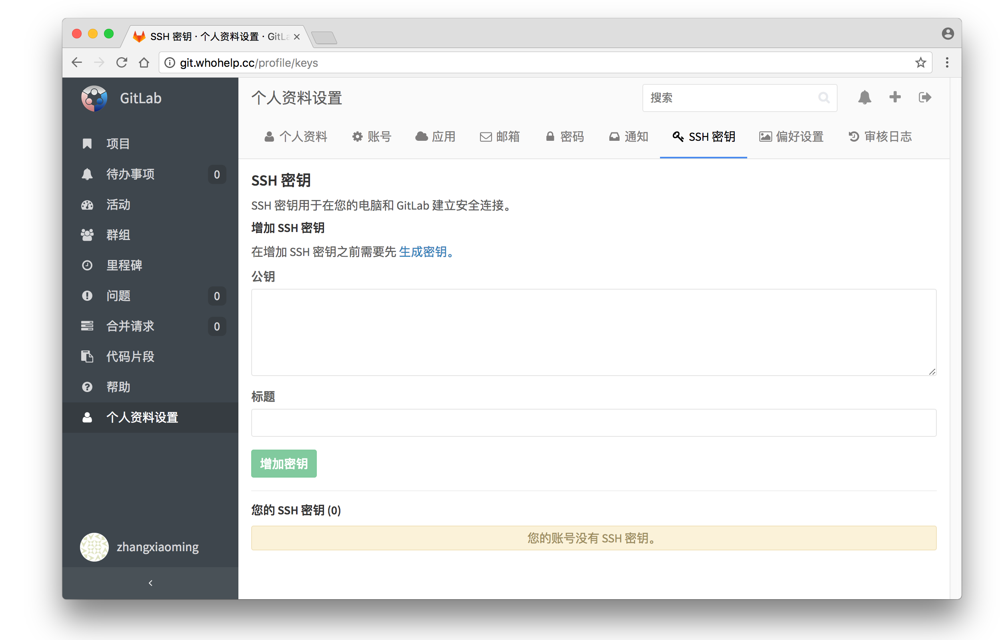

# GitLab 简介 #

[GitLab](https://baike.baidu.com/item/gitlab/3059600?fr=aladdin) 是一套公司内部部署的 Git 系统和 GitHub 具有类型的功能

是一个版本控制的一个 Web 环境用来管理项目的源代码的, 它是开源的

被许多公司用来搭建自己的 Git 仓库的系统, 类似已有 [GitHub](https://github.com/) 虽然可以使用, 

但是在公司内部使用过程中会遇到诸多的不便比如: 

> 1. 由于是外国的网址在国内使用网速会很卡,可能还需要翻墙使用科学上网工具才能使用
> 2. GitHub 公司虽然是做开源的市场但是 GitHub 系统并不开源
> 3. 相比 GitHub 私有仓库需要收费, 而公司常用的这套版本是无需收费的
> 4. 相比较而言内网部署可以带来很多有必要的保密性, 避免代码泄露
> 5. GitLab 口碑和实用性不比 GitHub 弱, 在内网实用速度快, 效率高


## 安装工具 ##
在使用 Git 工具前要确保本机安装该工具, 

请到官网下载对应系统的工具并进行安装默认点下一步直至完成即可.

```
https://git-scm.com
```


#### 内网网址 ####

[GitLab](http://192.168.31.138/users/sign_in)  是内网地址下班回家是用不了的, 所以下班前**每天必须提交一次**到自己的独立开发分支上面, 并在提交说明中写上你做的哪些功能更改等等.


#### 系统界面: ####







**奇淫技巧**: 

>  在 hosts 文件中添加如下内容即可在浏览器地址栏中输入图片所示的地址
>
>  就可以打开公司 GitLab 首页, 避免忘记因为内网的 IP 地址而再去询问

##### macOS #####

```
/etc/hosts
```

##### Windows #####

```
C:\WINDOWS\system32\drivers\etc\hosts
```


添加如下内容:

```
192.168.31.138  git.whohelp.cc
```


## 申请账号 ##
需要申请 GitLab 账号的和项目负责人或者产品经理或项目经理: 比如 Web 前段找前端总负责人; Java 后台找 Java 负责人; iOS 找 iOS 总负责人说明情况需要申请账号的通知 GitLab 管理员也就是我; 或者直接联系我帮你开账号. 申请完毕后会在协作工具上发布相关的账号信息.


#### 向管理员申请账号 ####
**备注** 下面以张小明同志作例子大家自行参考


账号一般情况下都是姓名全称的拼音全小写组成例如:

姓名: 张小明

账号: zhangxiaoming

邮箱: zhangxiaoming@whohelp.cc

**忘记密码** 后第一时间找管理员修改密码, 绝对不允许因为忘记密码而不提交. 这将会影响到你的考核


## Git GUI 工具 ##
推荐使用 **SourceTree** 工具是汉化的软件且是免费的非常方便操作. 

如果你是命令行用户自行去学习相关高级命令.
这个工具需要用邮箱注册后才可以免费使用, 下面介绍安装和破解的方法:


#### maxOS 系统下使用 ####
**下载地址:** 

```
https://github.com/MeetLucky/HuBan-VersionControl/blob/master/install/macOS/SourceTree.zip?raw=true
```


**破解文件:**

```
https://github.com/MeetLucky/HuBan-VersionControl/blob/master/install/macOS/sourcetree.license?raw=true
```


下载应用程序并放到如下应用程序目录如下所示:

```
/Applications/SourceTree.app
```


将破解文件放置到下面的目录中:

```
/Users/MeetLucky/Library/Application Support/SourceTree/sourcetree.license
```


#### Windows 系统下使用 ####
**下载地址:** 

```
https://github.com/MeetLucky/HuBan-VersionControl/blob/master/install/Windows/SourceTree.zip?raw=true
```

**破解文件:**

```
https://github.com/MeetLucky/HuBan-VersionControl/blob/master/install/Windows/accounts.json?raw=true
```


双击解压后双击安装包文件: Windows 下需要**安装 .NET Framework** 才可以使用, 运行应用程序根据提示去微软官网下载后进行安装, 最后将破解文件文件放到该目录下, 最后文件路径如下所示:

```
%LocalAppData%\Atlassian\SourceTree\accounts.json
```

重新打开 SourceTree 软件开始后即可立即使用

**注意事项:** 实践过程中发现在 Windows 10 系统中破解会无效在 

```
%LocalAppData%\Atlassian\SourceTree\
```

目录下已经有生成的 **accounts-一长串字符.json** 文件, 直接复制下载的文件将破解文件的内容

全部复制粘贴替换掉原先的配置才能完成破解, 否则还是无法进行破解


### 设置 SSH Key ###

首先要查看一下当前系统中是否已经配置过 SSH , 如果不进行配置系统会拒绝你在仓库中进行任何的操作当然是有权限的控制了, 打开如下所示的路径:

#### macOS  ####
```
/用户/你的用户名/.ssh/
```

#### Windows ####
```
C:\Users\你的用户名\.ssh\
```


如果路径存在而且有子文件说明你已经配置过你将会看到如下所示的一些文件:

```
id_rsa
id_rsa.pub
...
```


其中 **.pub** 后缀名结尾的文件内容将会是我们配置的关键所在


## 方法一 ##
针对系统中未存在上面路径所示的文件或文件夹的用户

#### macOS ####
运行终端 ( **Terminal** ) 应用程序, 运行终端

#### Windows ###
进入用户目录并新建文件夹重命名为 **.ssh**, 双击进入该文件夹在空白处右键选择 **Git Bash Here** 打开命令行窗口, 保证下面的命令创建时保存的路径不会有问题

在打开的命令行窗口中输入下述的命令:

```
ssh-keygen -t rsa -C "zhangxiaoming@whohelp.cc"
```


系统输出:

```
Generating public/private rsa key pair.
Enter file in which to save the key (/Users/MeetLucky/.ssh/id_rsa):
```


直接按下回车即可在用户主目录中创建 **.ssh**文件夹和 **id_rsa** 与 **id_rsa.pub**

## 方法二 ##

针对已经配置过且接下去的配置会保留原有的文件不会被覆盖

#### macOS ####
运行终端 ( **Terminal** ) 应用程序, 运行终端

#### Windows ###
进入用户目录打开名为 **.ssh** 的文件夹, 双击进入该文件夹在空白处右键选择 **Git Bash Here** 打开命令行窗口, 保证下面的命令创建时保存的路径不会有问题

在打开的命令行窗口中输入下述的命令:

```
ssh-keygen -t rsa -C "zhangxiaoming@whohelp.cc"
```


系统输出:

```
Generating public/private rsa key pair.
Enter file in which to save the key (/Users/MeetLucky/.ssh/id_rsa):
```

**这个时候就不能直接按回车了** 在命令后面输入 **id_rsa_huban** 后按回车这样就不会按照默认名称来创建配置文件了, 打开 **.ssh** 文件夹可以看到多出的两个文件文件:

```
id_rsa
id_rsa.pub
id_rsa_huban
id_rsa_huban.pub
...
```

系统中有两个公钥文件那 Git 是如何知道你使用的是哪一个呢? 通过一个配置文件来识别的, 在  **.ssh** 目录下面新建一个文件并将重命名为 **config** 注意文件是没有后缀名的打开文件并输入下面的配置

```
# GitHub 配置
Host github.com
HostName github.com
PreferredAuthentications publickey
IdentityFile ~/.ssh/id_rsa

# GitLab 配置
Host 192.168.31.138
HostName 192.168.31.138
PreferredAuthentications publickey
IdentityFile ~/.ssh/id_rsa_huban
```


最后目录文件显示结果如下:

```
config
id_rsa
id_rsa.pub
id_rsa_huban
id_rsa_huban.pub
...
```


### 配置公钥 ###
进入 **.ssh** 文件夹加使用文本编辑器打开 .pub 后最近结尾的文件并复制内容到 GitLab 的个人资料设置 -> SSH  秘钥界面里面粘贴并保存如下图界面, 保存成功后就可以使用本电脑进行 Git 相关操作了. 如果您期间更换了电脑需要重新按照命名走一遍并重新配置秘钥.



```
cat id_rsa_huban.pub
```

**配置用户名和邮箱**

用户全局的配置对当前系统账号有效: **(推荐)**

```
git config --global user.name "张小明"
git config --global user.email "zhangxiaoming@whohelp.cc"
```


单独的仓库配置只针对某个仓库生效其他的项目中无效: **(不推荐)**

```
git config user.name "张小明"
git config user.email "zhangxiaoming@whohelp.cc"
```

**这个要进入到你项目的文件夹中进行配置**


互办科技欢迎您的加入!!!